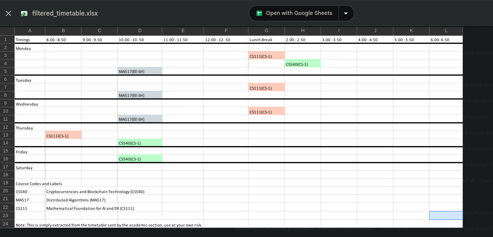

# Custom Timetable Generator

Course registration often means piecing together a personal schedule from a timetable made for an entire batch. This small utility was built to make that everyday task quicker: choose the courses you are taking, and get a readable timetable with only those courses, delivered as an Excel attachment to your email.

## Why It Helped

Before registration, students could try different combinations of courses and see how each combination fit across the week. That made it easier to spot timetable clashes early, compare possible schedules, and plan course choices before committing. Instead of repeatedly searching through one large timetable containing every course, students could get a focused view of just the courses they were considering, saving the time and effort of checking everything manually.

## Example Timetables

Each selected course is highlighted in the generated spreadsheet, making it easier to follow across the week. These examples show a smaller selection and a larger combination of courses.




## What It Does

- Search the course list by course code or name.
- Select multiple courses and enter an email address.
- Generate a filtered, color-coded `.xlsx` timetable and email it to the student.
- Keep the original timetable's day and time layout, with the selected course names listed below it.

The course catalog and source timetable are specific to the semester represented by the included data. Check the source timetable before relying on a generated schedule.

## How It Works

The React frontend sends the selected course codes and recipient email to an Express endpoint. The backend filters `backend/schedule2.xlsx`, formats the result, and sends it using Gmail SMTP.

## Run Locally

Requirements: Node.js and npm. Use Node.js 24 for parity with the current Vercel deployment configuration.

### Backend

From the repository root:

```bash
cd backend
npm install
```

Create `backend/.env` with your own sender account settings:

```dotenv
EMAIL=your-sender@gmail.com
PASSWORD=your-gmail-app-password
PORT=3001
```

For Gmail, use an app password rather than your regular account password. Keep `.env` private and never commit real credentials.

Start the server:

```bash
node server.js
```

The backend listens on `http://localhost:3001` by default. It expects `backend/schedule2.xlsx` to be present.

### Frontend

In a separate terminal, from the repository root:

```bash
cd frontend/client
npm install
npm run dev
```

Vite prints the local development URL when it starts. The frontend currently sends requests to the deployed backend URL in `src/App.jsx`; local frontend requests will therefore use that deployment unless you change the URL to your local backend.

## Deployment

The backend is configured for Vercel in `backend/vercel.json`. Set `EMAIL` and `PASSWORD` in the Vercel project's Production environment variables, and use the Node.js version selected in the Vercel project settings. Pushes to the connected Git branch trigger deployments.

The backend limits submissions to five requests per email address per 24-hour window.

## Project Layout

```text
backend/
	server.js          Express API and timetable generation
	schedule2.xlsx     Source timetable used by the API
	vercel.json        Vercel function routing
frontend/client/
	src/App.jsx        Course catalog and timetable form
```

## Data and Credentials

The included timetable and course catalog are semester-specific. Replace them when the official schedule changes, and verify generated results against the latest source timetable. Email addresses entered into the site are used as the delivery destination.

Configure mail credentials through environment variables. Never publish real credentials or commit a populated `.env` file.

